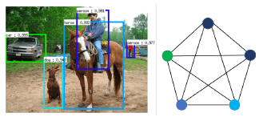
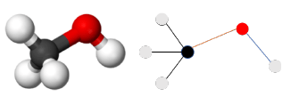
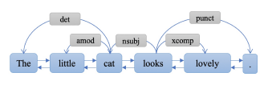
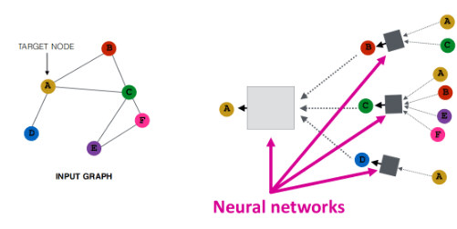

# Rapport technologique de veille : Réseaux de neurones sur les graphes

### Rémi Cecchinato

Ce site fait un état de l'art des réseaux de neurones sur les graphes.

## Intérêts et applications

Les réseaux de neurones classique ont prouvé leur utilité dans de nombreux domaines et pour l'analyse de nombreux types de données (images, texte, ...).
Cependant certains formats de données ne sont pas compatibles avec ces réseaux de neurones, notemment les graphes.
Il existe de nombreuses applications qui utilisent des réseaux de neurones sur les graphes pour gérer ces formats de données atypiques.

### Analyse d'images

L'analyse d'images est un sujet déjà extensivement traité par les réseaux de neurones classiques, notement pour identifier les objets présents sur une image donnée.
Cependant il est difficile d'interpréter les relations entre les différents objets présentes sur une même image.

Cela est particulièrement détaillé dans [0] et [1]. 

### Systèmes de recommendation

L'objectif d'un système de recommendation est de proposer des produits pertinents à des clients.
C'est un problème traditionellement complexe.
Il est cependant très simplement modélisable avec un graphe ou chaque noeud est soit un client, soit un produit, un est établi entre deux clients si ils ont les mêmes goûts, entre deux produits s'ils sont similaires, et un lien entre un client et un produit est créé si un client apprécie ce produit.
L'objectif d'un système de recommendation est alors de proposer de nouveaux liens client <-> produit pertinents.

Les réseaux de neurones sur les graphes sont donc particulièrement adaptés à ce problème.
Ils ont donc été étudiés dans de nombreux articles, dont [2] et [3].

### Chimie

L'utilisation de graphes est très naturelle pour représenter des molécules.
En particulier les réseaux de neurones sur les graphes sont très utilisés pour prédire les réactions chimiques possibles entre les molécules [4], mais aussi pour optimiser des molécules [5], c'est à dire trouver de nouvelles molécules (typiquement des médicaments) qui ont certaines propriétés.

### Traitement du language naturel

Le traitement du language naturel est un domaine qui utilise déjà énormément les réseaux de neurones.
Cependant la représentation de la structure d'une phrase a toujours été un problème épineux.
Les réseaux de neurones sur les graphes permettent une nouvelle approche pour tenter de résoudre ce problème.
En effet en modélisant chaque mot comme un noeud d'une graphe et les relations gramaticales entre les mots comme des arrêtes (par exemple quel mot est le sujet de quel verbe, quels sont les adjectifs qui décrivent nu nom, etc...) il est possible de représenter éfficacement une phrase [6].

## Théorie

## Outils et librairies

## Bibliographie

[0] Willies Olga. « An Introduction to Graph Neural Networks », Consulté le 12 février 2021, https://www.section.io/engineering-education/an-introduction-to-graph-neural-network/.

[1] Raposo, David, Adam Santoro, David Barrett, Razvan Pascanu, Timothy Lillicrap, et Peter Battaglia. « Discovering Objects and Their Relations from Entangled Scene Representations ». ArXiv:1702.05068 [Cs], 16 février 2017. http://arxiv.org/abs/1702.05068.

[2] Gong, Yu, Yu Zhu, Lu Duan, Qingwen Liu, Ziyu Guan, Fei Sun, Wenwu Ou, et Kenny Q. Zhu. « Exact-K Recommendation via Maximal Clique Optimization ». ArXiv:1905.07089 [Cs], 16 mai 2019. http://arxiv.org/abs/1905.07089.

[3] Wu, Shu, Yuyuan Tang, Yanqiao Zhu, Liang Wang, Xing Xie, et Tieniu Tan. « Session-Based Recommendation with Graph Neural Networks ». Proceedings of the AAAI Conference on Artificial Intelligence 33 (17 juillet 2019): 346‑53. https://doi.org/10.1609/aaai.v33i01.3301346.

[4] Do, Kien, Truyen Tran, et Svetha Venkatesh. « Graph Transformation Policy Network for Chemical Reaction Prediction ». ArXiv:1812.09441 [Cs], 21 décembre 2018. http://arxiv.org/abs/1812.09441.

[5] Jin, Wengong, Kevin Yang, Regina Barzilay, et Tommi Jaakkola. « LEARNING MULTIMODAL GRAPH-TO-GRAPH TRANSLATION FOR MOLECULAR OPTIMIZATION », 2019, 13.

[6] Yao, Liang, Chengsheng Mao, et Yuan Luo. « Graph Convolutional Networks for Text Classification ». ArXiv:1809.05679 [Cs], 13 novembre 2018. http://arxiv.org/abs/1809.05679.

