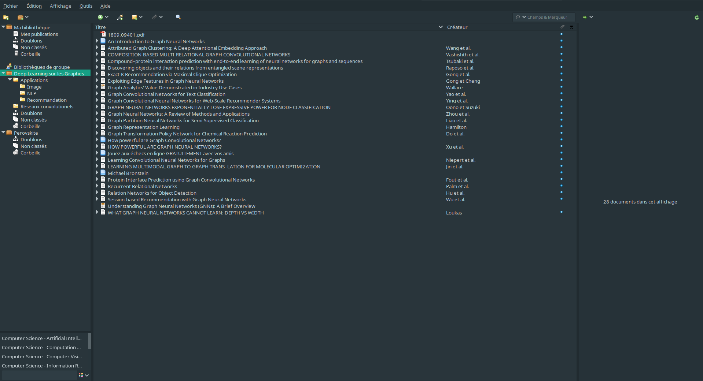
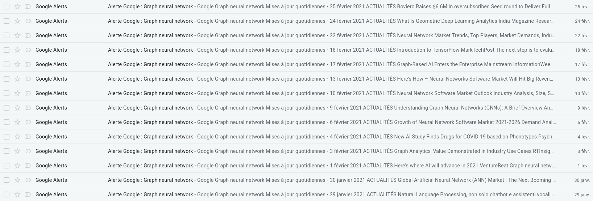
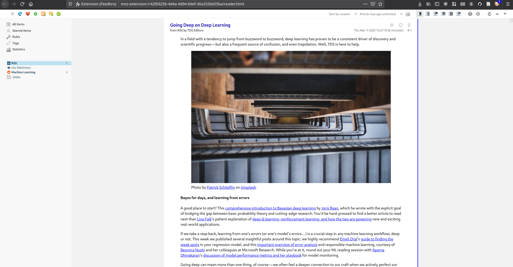

Rapports de veille technologique Réseaux de neurones sur les graphes
====================================================================

Rémi Cecchinato
---------------

Cette page contient le rapport méthodologique de veille et le rapport technique.

Rapport méthodologique de veille
================================

Objectif de la veille
---------------------

L'objectif de cette veille technologique est d'établir un état de l'art des dernière avancées sur les réseaux de neurones sur les graphes (GNNs) ainsi que de toutes leurs applications actuelles et potentielles.

Outils utilisés
---------------

Pour cette veille méthodologique j'ai utilisé trois outils.

Le premier d'entre eux est le gestionaire de sources Zotero.
Zotero m'a fortement été utile pour conserver les documents lus ou à lire en relation avec ma veille technologique et de les trier en fonction de leur thématique (Applications pratiques, modèles techniques, avenir de la technologie, ...).
Ma bibliothèque Zotero est disponible sur [ce lien](https://www.zotero.org/groups/2714739/deep_learning_sur_les_graphes/library).

Le second outil que j'ai utilisé est Google Alerts.
J'ai utilisé Google Alerts pour me tenir informé des dernières avancées sur les réseaux de neurones sur les graphes.
J'ai donc créé des alertes avec les mots clés "Réseaux de neurones" et "graphes", avec leurs équivalents en anglais, ainsi que les acronymes qui y sont associés.
Les alertes étaient quotidiennes pour pouvoir suivre très régulièrement les dernières avancées.
Dans le cadre de l'objectif de cette veille je suis volontairement resté large dans mes requettes Google Alerts.
Malgré cela j'ai rapidement réalisé que Google Alerts seul ne me permettrait pas de réaliser un état de l'art satisfaisant.

J'ai donc décidé d'utiliser Feedbro comme troisième outil pour cette veille technologique.
J'ai utilisé Feedbro pour récupérer les flux RSS de [Toward Data Science](towardsdatascience.com) et [le sub-reddit sur le machine learning](reddit.com/r/MachineLearning).
Ces deux sources m'ont permis d'agrandir considérablement le champs de ma veille technologique, c'est pourquoi je ne me suis pas abonné à plus de flux RSS ni utilisé d'autres outils de veille comme Twitter par exemple.

Procesus de veille
------------------

Une à deux fois par semaine, j'ai lu les articles levés par les alertes Google Alerts et Feedbro.
À partir de ces lectures j'ai sois écarté sois gardé les articles que j'ai lu, et pour ceux que j'ai lu j'ai également ajouté certaines de ses sources à la liste des articles à lire.

Difficultés rencontrées
-----------------------

La principale difficulté que j'ai rencontré est qu'il n'existait pas de flux RSS visant les réseaux de neurones sur les graphes spécifiquement.
Les flux RSS auquels je me suis abonné n'étaient donc que des flux ayant pour thématique les réseaux de neurones et j'ai du filtrer à la main les articles spécifiques aux GNNs.
Ce filtrage manuel a été un frein à la réalisation de cette veille technologique.

Conclusion
----------

Cette méthodologie de veille m'a permis de remplir mon objectif d'établissement d'un état de l'art.
Malgré cela j'ai épprouvé des difficultés pour filtrer les flux RSS, ce qui m'a empécher d'élargir ma veille à Twitter.
